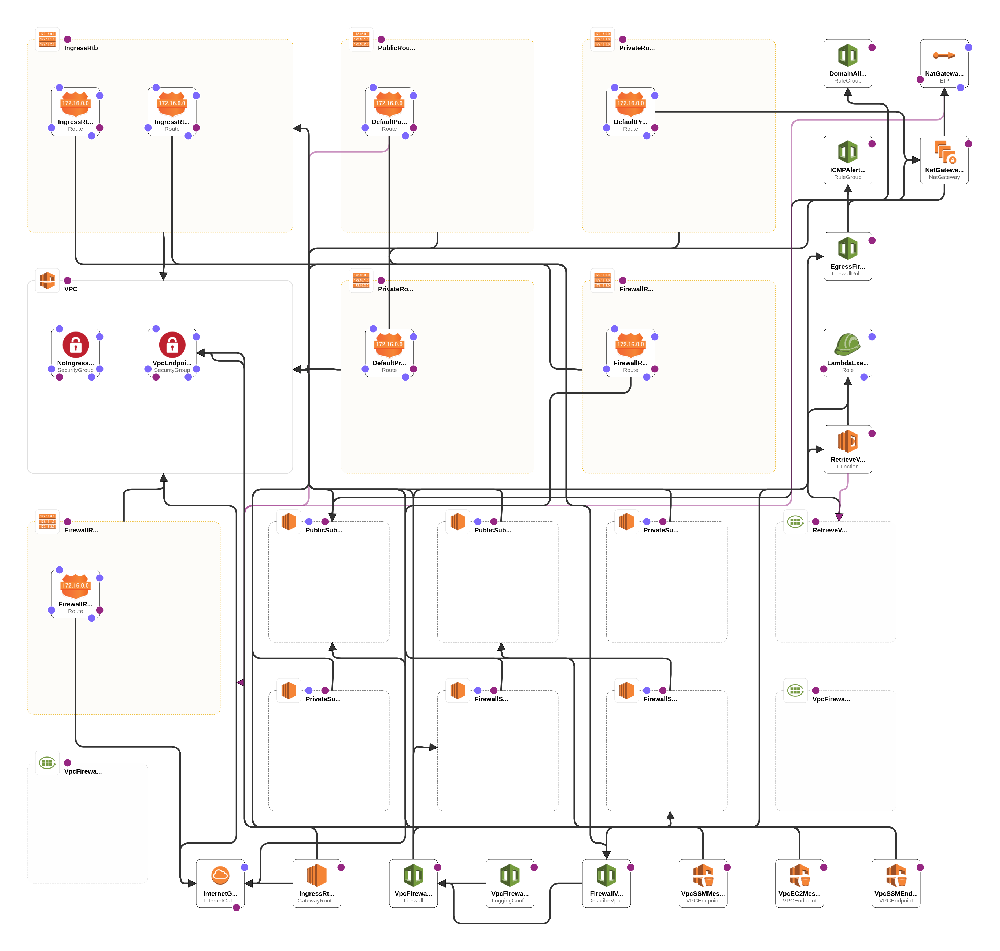

# Network Firewall VPC Deployment

This repository contains CloudFormation templates to deploy an AWS Network Firewall into each Virtual Private Cloud (VPC) for enhanced protection. Each VPC is individually safeguarded, and the blast radius is minimized by isolating the VPCs. There is no requirement for inter-VPC connectivity or connection to an AWS Transit Gateway. Each AWS Network Firewall can have its own firewall policy or utilize common rule groups, which are reusable collections of rules, across multiple firewalls. This approach enables independent management of each AWS Network Firewall, reducing the likelihood of misconfiguration and limiting the potential impact.

## Architecture Overview

The deployment is based on a Spoke VPC model, where each VPC consists of three subnets in each Availability Zone (AZ):

1. **Private subnet** - This subnet is dedicated to the application or client instances and remains inaccessible from external networks.
2. **Public subnet** - This subnet hosts a NAT Gateway, allowing instances in the private subnet to initiate outbound connections while remaining hidden from external entities.
3. **Firewall subnet** - This subnet serves as the endpoint for the AWS Network Firewall. It handles the traffic filtering and protection for the VPC.

## Deployment Steps

Follow the steps below to deploy the Network Firewall VPC setup:

1. Clone this repository to your local environment or download the CloudFormation template files.

2. Open the AWS Management Console and navigate to the CloudFormation service.

3. Create a new stack and specify the location of the CloudFormation template file `NAT_vpc_anfw_2az.yml`.

4. Provide the necessary parameters required for the deployment, such as VPC CIDR blocks, subnet configurations, and other network-related details.

5. Review the configuration and click on "Create stack" to initiate the deployment.

6. Once the stack creation is complete, AWS Network Firewalls will be provisioned in each VPC, along with the associated subnets and routing tables.

## Routing Configuration

To ensure the return traffic is directed through the firewall endpoint in the same AZ, an Ingress Route Table is associated with the Internet Gateway. This route table should have a route entry pointing towards the firewall endpoint located in the same AZ. By doing so, the traffic flow is correctly managed, and the necessary security checks are applied before the traffic reaches its destination.

## Additional Resources

For more information on AWS Network Firewall and its capabilities, please refer to the following documentation:

- [AWS Network Firewall Documentation](https://docs.aws.amazon.com/network-firewall)

## License

This project is licensed under the [MIT License](LICENSE). Feel free to modify and adapt it to your specific needs.

**Note:** This deployment is provided as a starting point and should be reviewed and customized based on your specific requirements and security policies.
